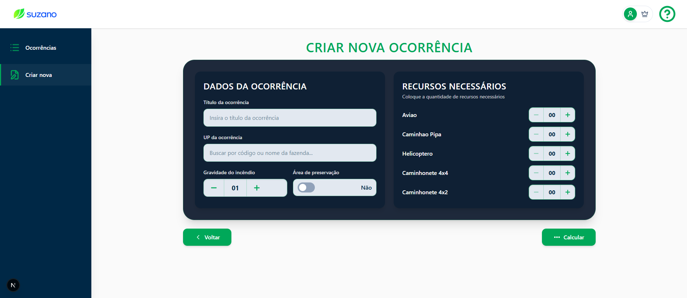

# Teste de Usabilidade

## 1. Tela Analisada - Formulário de Criação de Ocorrência

Figura 1: Formulário de criação de ocorrência

Fonte: Material produzido pelos autores (2026)

**Contexto:** O operador acessa esta tela para registrar um novo foco de incêndio, preenchendo em uma única tela dados como localização (UP), gravidade, área de preservação e recursos necessários antes de acionar o cálculo de alocação.

## 2. Tipo de Teste

&ensp; O que será testado: A capacidade do operador de preencher corretamente o formulário de criação de ocorrência, compreender o campo de busca com autocomplete da UP e os controles numéricos de recursos e acionar o cálculo sem erros ou hesitações.

## 3. Conjunto de Perguntas

**1.** Ao olhar para esta tela pela primeira vez, o que mais chama a sua atenção? O que você faria agora?

**2.** Imagine que você precisa registrar um foco de incêndio na Unidade Produtiva "Fazenda Serra Verde". Como você faria isso nesta tela? Vá em frente.

**3.** Você precisa indicar que o incidente requer 2 aviões e 1 helicóptero. Como ajustaria esses valores? O que os botões + e − significam para você?

(Observar se o usuário percebe e usa o campo de autocomplete, digita parte do nome ou do código e confirma a seleção visualmente)

**4.** Antes de clicar em "Calcular", como você saberia que preencheu tudo o que é obrigatório? Tem alguma informação nesta tela que não ficou clara ou que você não sabe para que serve?

## 4. Ação ou Entendimento Esperado

&ensp; O operador deve ser capaz de preencher o título, selecionar a UP via autocomplete, definir a gravidade e os recursos necessários e clicar em "Calcular", compreendendo que campos em branco impedirão o avanço e que o autocomplete filtra as unidades produtivas em tempo real conforme a digitação.
