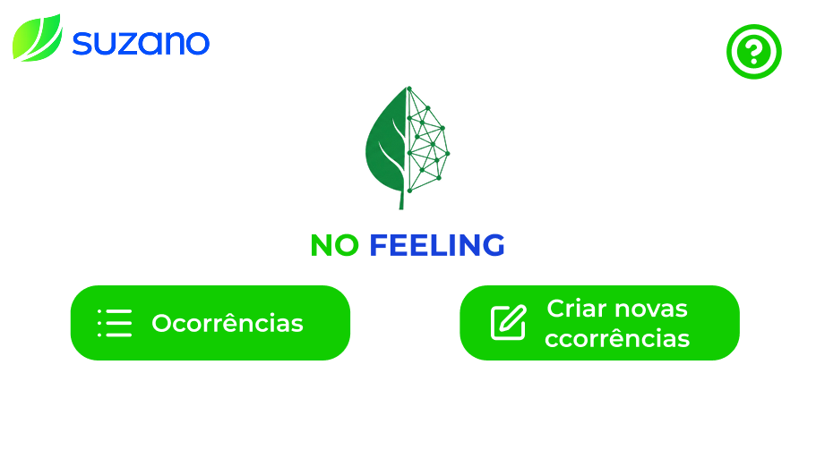
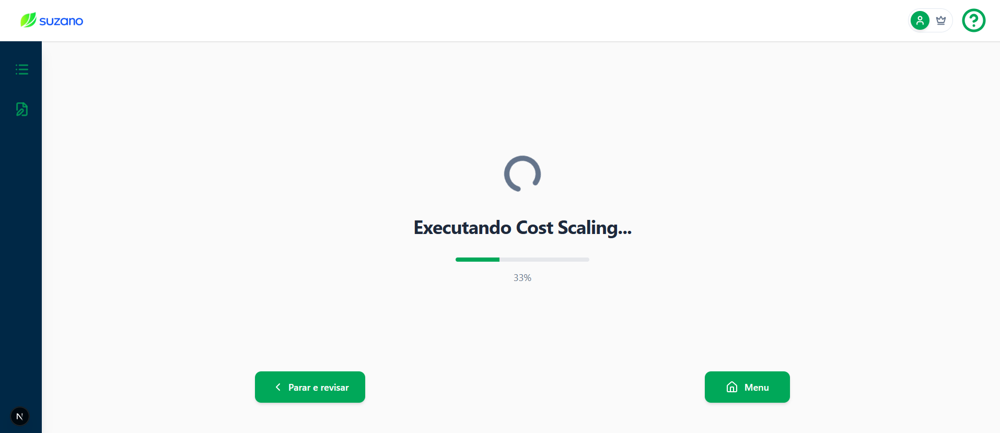
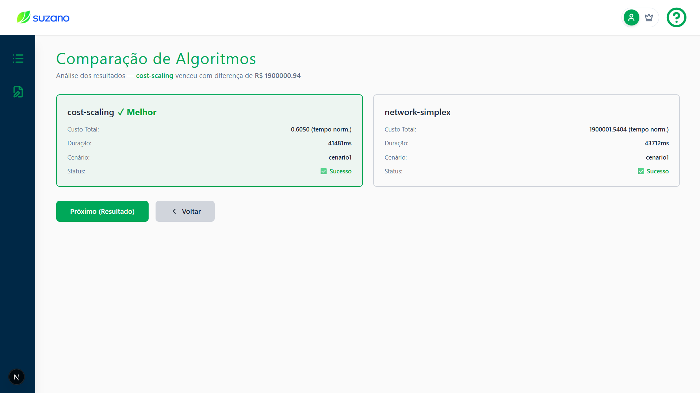
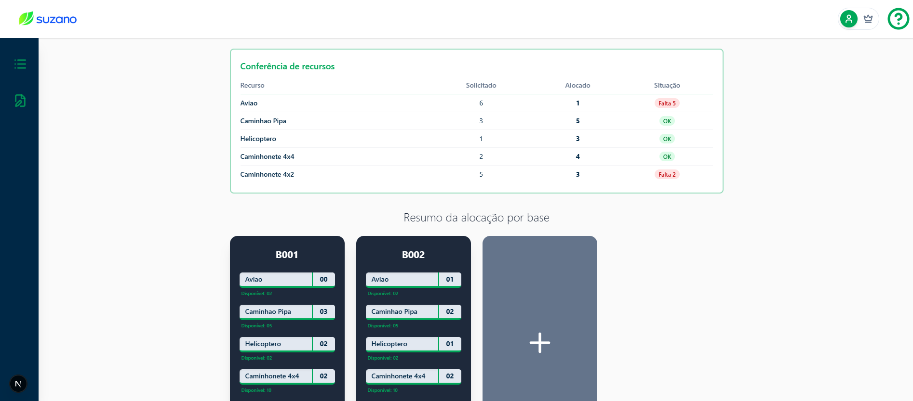

# Teste de Usabilidade — Fluxo Completo de Criação de Ocorrência

## 1. Telas Analisadas

Fluxo analisado: Criação completa de uma ocorrência, do formulário inicial até a confirmação da alocação de recursos

| Etapa | Tela |
| :---: | :--- |
| 1 | Homepage |
| 2 | Formulário unificado de criação |
| 3 | Progresso de execução dos algoritmos |
| 4 | Comparação dos algoritmos |
| 5 | Resultado e confirmação da alocação |

Figura 1: Etapa 1 — Homepage

Fonte: Material produzido pelos autores (2026)

Figura 2: Etapa 2 — Formulário unificado de criação de ocorrência

Fonte: Material produzido pelos autores (2026)

Figura 3: Etapa 3 — Tela de progresso com execução sequencial dos dois algoritmos

Fonte: Material produzido pelos autores (2026)

Figura 4: Etapa 4 — Comparação lado a lado dos resultados (Cost Scaling vs Network Simplex)

Fonte: Material produzido pelos autores (2026)

Figura 5: Etapa 5 — Tela de resultado com mapa, painel de demanda e cards de alocação

Fonte: Material produzido pelos autores (2026)

Contexto: O operador precisa registrar um novo foco de incêndio, acompanhar o processamento automático dos algoritmos de otimização, interpretar a comparação entre eles e confirmar (ou ajustar) a sugestão de despacho de recursos gerada pelo sistema.

## 2. Conjunto de Perguntas

1. Quando você recebe um alerta de foco de incêndio, quais são as primeiras decisões que precisa tomar? O que você espera que um sistema de apoio faça por você nesse momento?

2. Veja esta tela. Imagine que você acaba de receber um alerta de incêndio na Unidade Produtiva "Fazenda Serra Verde" com gravidade "2". Registre essa ocorrência no sistema. A partir daqui, o que você faria primeiro? Continue até onde conseguir.

3. Após clicar em "Calcular", uma nova tela aparece. O que está acontecendo aqui? O que o sistema está fazendo, na sua interpretação? Você esperaria algo diferente neste momento?

4. Agora você vê dois resultados lado a lado. O que essa tela está te dizendo?

5. Você chegou à tela final com o mapa e os cards de recursos. Como você saberia se a alocação sugerida pelo sistema é suficiente para esta ocorrência? Existe alguma informação neste fluxo que ficou pouco clara ou que você não teria certeza do que fazer?

## 4. Ação ou Entendimento Esperado

&ensp; O operador deve ser capaz de preencher o formulário, aguardar o processamento compreendendo que dois algoritmos estão sendo comparados, selecionar conscientemente a melhor solução com base nas métricas exibidas e, na tela de resultado, validar se a alocação cobre toda a demanda, ajustando os cards manualmente quando necessário, antes de confirmar o despacho.
